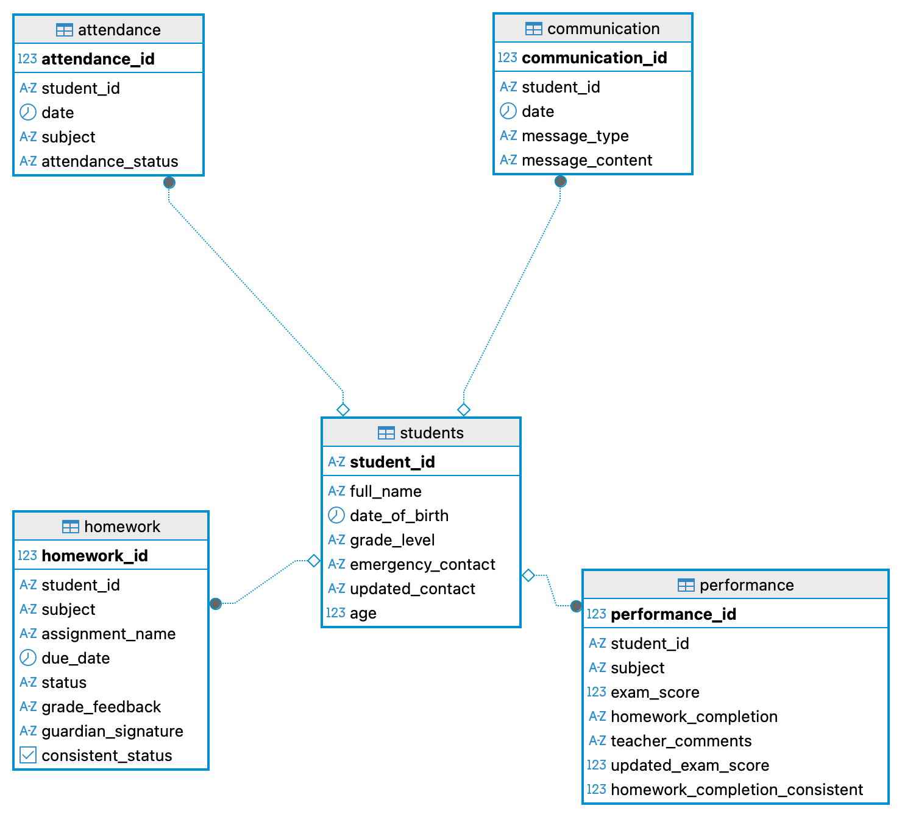
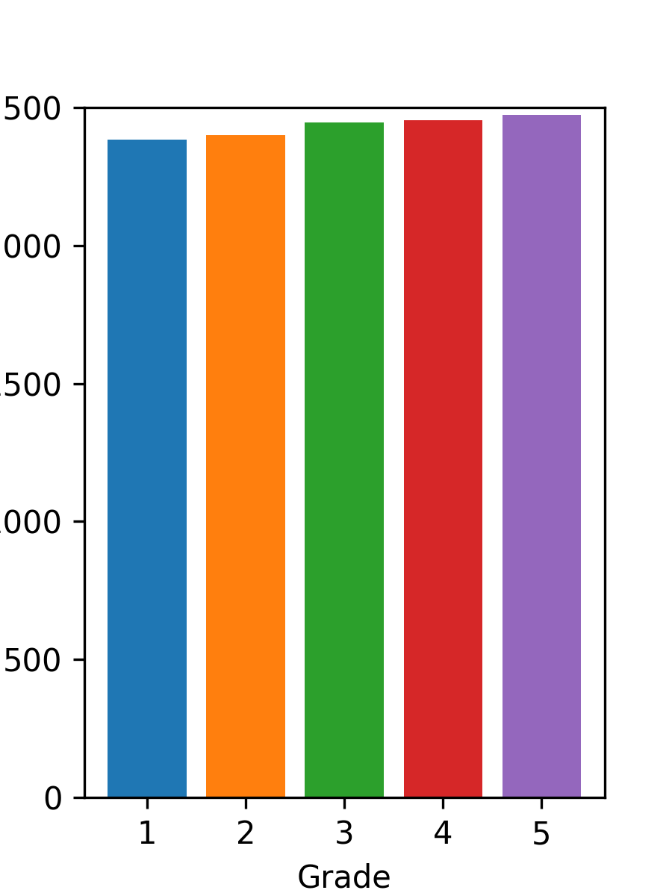
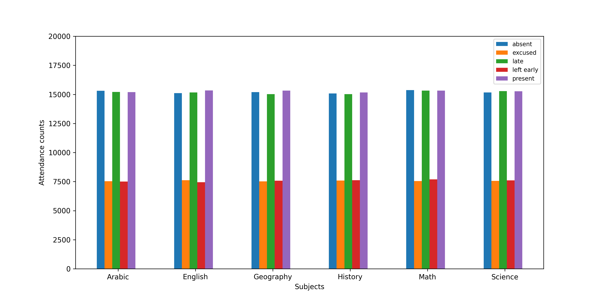
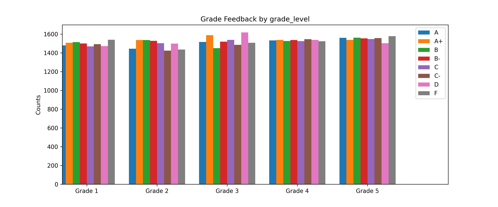
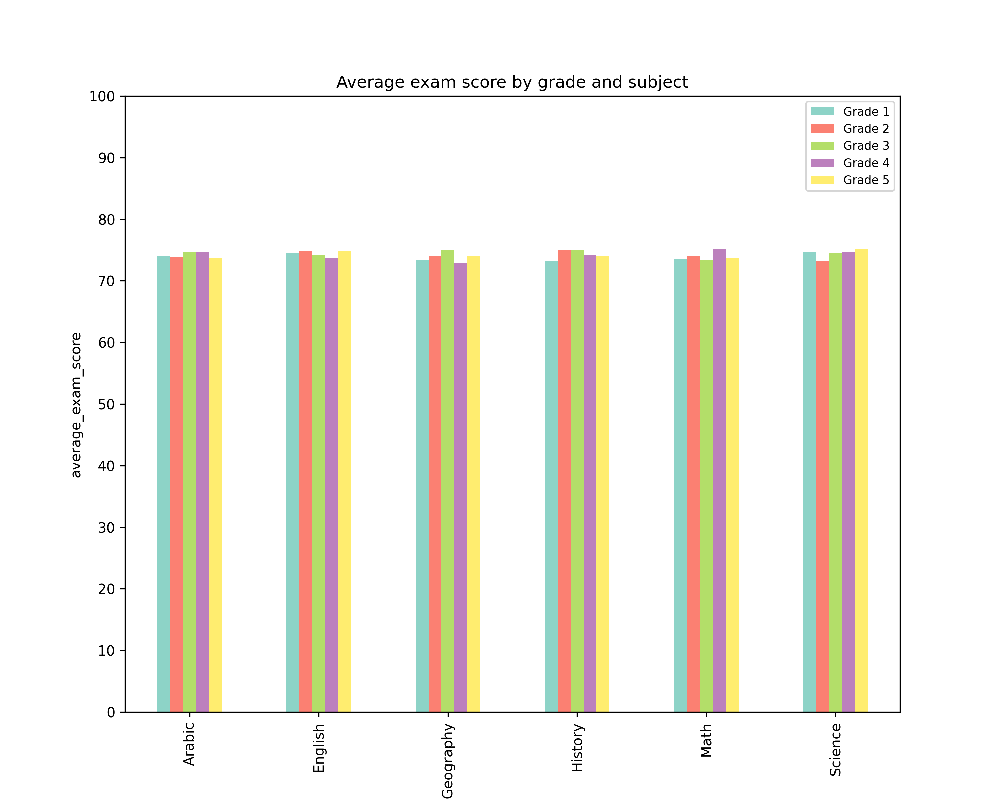
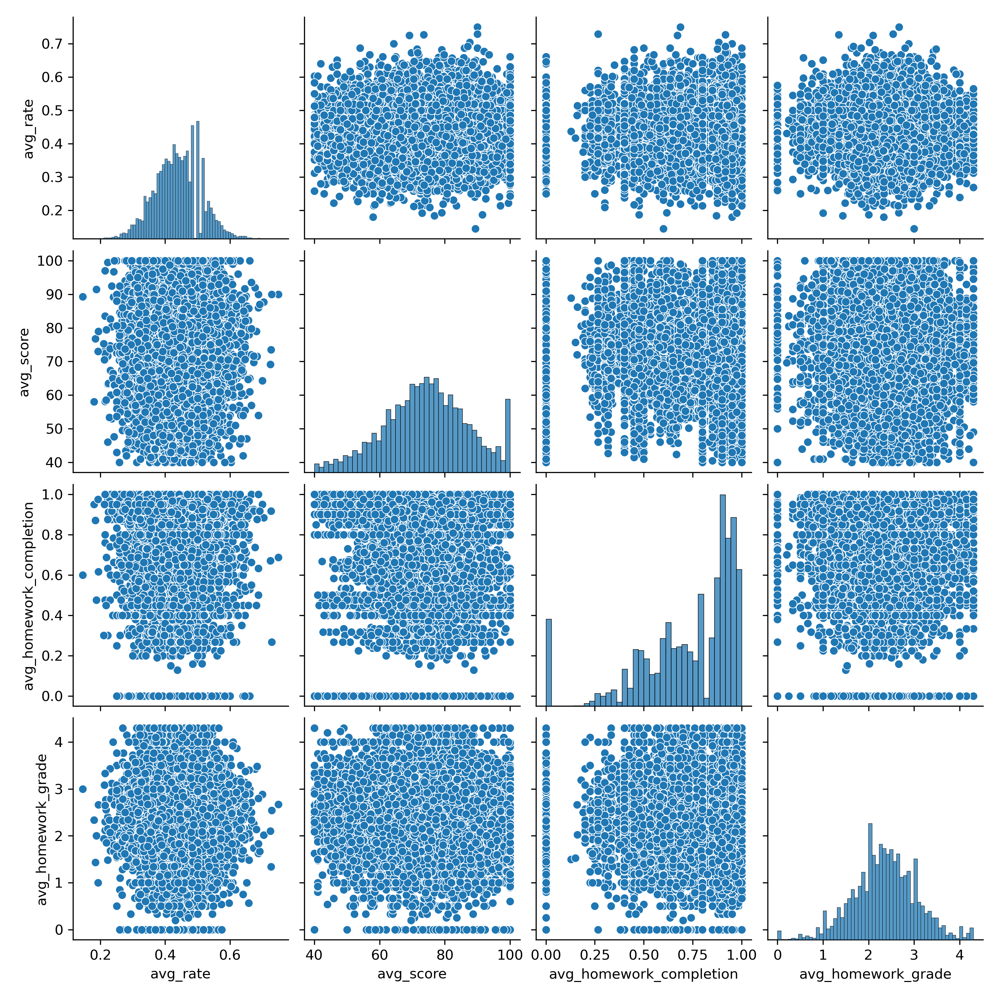
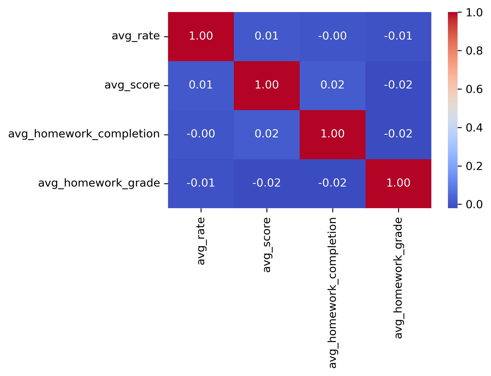

# PostgreSQL Student Performance and Attendance Analysis

## 1. Introduction
The goal of this project was to integrate SQL queries with python to clean up, explore and visualise data. 

## 2. Database Setup
The dataset can be found at [Kaggle](https://www.kaggle.com/datasets/marvyaymanhalim/student-performance-and-attendance-dataset/code). The csv files are imported into the database using this [script](./scripts/student). The script also checks the data to ensure that the imported data are consistent. 

After establishing the relationships among tables, the resulted schema diagram:


## 3. SQL queries
- **Query 1:** calculate the age of students ([script](./scripts/calculate_students_age.sql))
```sql 
/* use the built in function extract() and age() */
alter table students 
add column "age" int;

update students
set "age" =  extract(year from age(current_date, date_of_birth));
```

- **Query 2:** data cleaning
1. attendance_status in `attendance` table: correct typos and use lower case ([script](./scripts/data_cleaning_for_attendance_status.sql))
2. exam_score and homework_completion in `performance` table: make sure that the exam score is in the range of 0-100 and homework completion is between 0 and 1. Moreover, show the homework completion in a consistent way ([script](./scripts/data_cleaning_for_performance_table.sql))
3. emergency_contact in `students`table: the phone number are recorded in varying formats. The [script](./scripts/unite_phone_number_format.sql) convert all of them into the format of '[0-9]{3}-[0-9]{3}-[a-z0-9]+'.
4. status in `homework`table: there are a range of ways to show whether the homework is completed or not. The [script](./scripts/unite_the_format_of_homework_completion_status.sql) add a new column to the table and show the status as a boolean. 


- **Query 3:** the communication between teachers and parents are important. The messages are grouped by the type and the grade level of students. Also, each type of message used for different grade level is ranked by its frequency.

[script](./scripts/group_message_type.sql)

```sql
-- the unique ways of contacting
select distinct message_type
from communication;

-- the number of each message_type for grade
select s.grade_level, c.message_type, count(c.message_type), rank() over(partition by c.message_type order by count(c.message_type))
from communication c 
join students s 
on c.student_id=s.student_id 
group by c.message_type, s.grade_level
order by c.message_type, s.grade_level;
```
The complete output: [group_message_type.csv](./outputs/csvs/group_message_type.csv)


- **Query 4:** Being present for classes is import for the academic performance. The attendance_status in the `attendance` table has five levels: present, absent, late, left early, and excused. With the [SQL query](./scripts/order_students_by_attendance.sql), we would like to find out the attendance rate of students. To be noted, present, late, and left early are all considered to be attended the classes. 

**Result (sample):**

| student_id | present_rate |
|------------|--------------|
| S05912     | 0.06         |
| S09329     | 0.06         |
| S02113     | 0.07         |
| S08730     | 0.07         |
| S10549     | 0.07         |

Ful result: [order_students_by_attendance.csv](./outputs/csvs/order_students_by_attendance.csv)


- **Query 5:** It is informative to know the number of students in each grade level. With this [function](./scripts/plot_students_distribution_by_grade_level.sql), the distribution of students is plotted. 
Figure: 


- **Query 6:** To find out the attendance of students for different subjects, a [customized function](./scripts/plot_attendance_status_by_grade_level.sql) is written. We can see from the plot that the attendance for each subject appears to be quite similar. 

Figure: 


- **Query 7:** Doing homework is crucial for the study. It can help the students understand the learnt content better and deeper. A [function](./scripts/plot_homework_grade.sql) is written to examine the homework feedback either by subject or by grade level. 

Figure 1: 
Figure 2: 


- **Query 8:** It is helpful to know the performance of students from different grade levels for each subject. To this end, a [customized function](./scripts/plot_average_exam_score.sql) is written to visualize the average exam score. 

Figure: 


- **Query 9:** There are four metrices, including attendance status, homework completion, homework feedback, and exam score, can reflect the performance of students at school. We first calculated the average value of each feature for individual students. For the categorical data, attendance status and homework feedback, they need to be mapped to numeric data before the computation. The mapping relatioships are show below. After the processing, a pairplot and a heatmap of correlations, which suggests that there is no obvious correlation between these features. 

Mapping the letter score of homework to standard GPA scale: 

| letter score | GPA |
|--------------|-----|
|      A+      | 4.3 |
|      A       | 4.0 |
|      A-      | 3.7 |
|      B+      | 3.3 |
|      B       | 3.0 |
|      B-      | 2.7 |
|      C+      | 2.3 |
|      C       | 2.0 |
|      C-      | 1.7 |
|      D+      | 1.3 |
|      D       | 1.0 |
|      D-      | 0.7 |
|      F       | 0.0 |

Mapping the attendance status to a numerical score reflecting the proportion of class attended: 

| attendance status | numerical score |
|-------------------|-----------------|
|      present      |        1        |
|       late        |       0.5       |
|    left early     |       0.5       |
|      absent       |        0        |
|     execused      |        0        |

[SQL script](./scripts/extract_matrices_for_students_evaluation.sql): convert categorical data to numerical ones and export the data into a [csv file](./outputs/csvs/student_evaluation.csv)

[Jupyter notebook](./scripts/plot_students_evaluation_metrices.ipynb): pairplot and heatmap of correlations between features



